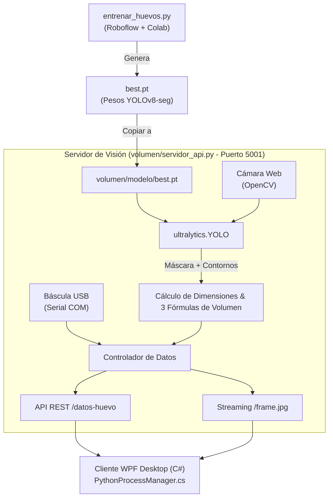

# Guía Técnica de Integración: Modelo IA YOLOv8 y Script de Entrenamiento

Este documento detalla la arquitectura, el flujo de trabajo y la integración paso a paso de los componentes de Inteligencia Artificial (**`modelo copia`** y **`entrenar-huevos.crdownload`**) dentro del servidor de visión activo (**`volumen/servidor_api.py`**) para la aplicación **loginavicola**.

---

## 📐 Arquitectura General del Sistema



---

## 🛠️ Parte 1: Integración y Flujo de `entrenar-huevos.crdownload`

### 1.1 Diagnóstico del Archivo
- **Nombre actual:** `entrenar-huevos.crdownload`
- **Causa:** El archivo es un script de Python exportado desde Google Colab (`Copia de entrenar_deteccion_huevos.ipynb`). La extensión `.crdownload` la asigna Google Chrome durante las descargas, pero el contenido de **196 líneas de código Python está completo e intacto**.
- **Acción:** Renombrar el archivo a `entrenar_huevos.py` y ubicarlo en la carpeta `scripts/` o `Documentacion/`.

### 1.2 Pipeline de Entrenamiento (Re-entrenamiento del Modelo)
El script realiza los siguientes 6 pasos automatizados:
1. **Instalación de dependencias:** Instala `roboflow`, `ultralytics` y `pycocotools`.
2. **Descarga del Dataset:** Se conecta a Roboflow (`sofia-bolanos/deteccion-huevos`) usando la API key configurada y obtiene las imágenes etiquetadas.
3. **Conversión de Formatos:** Transforma las máscaras RLE / COCO Segmentation a polígonos compatibles con YOLOv8-seg.
4. **Creación de `data.yaml`:** Estructura las rutas del dataset para `train`, `valid` y `test`.
5. **Entrenamiento:** Entrena `yolov8n-seg.pt` (versión Nano, ligera para CPU/GPU) durante 80 épocas con resolución 640x640.
6. **Exportación:** Produce el archivo `best.pt` con los pesos óptimos de detección.

### 1.3 Integración con el Proyecto
Cada vez que se re-entrene el modelo con nuevas fotos de huevos:
1. Correr `entrenar_huevos.py` (en Colab o PC local).
2. Tomar el archivo resultante `best.pt`.
3. Reemplazar el archivo en **`volumen/modelo/best.pt`**.

---

## ⚡ Parte 2: Integración de `modelo copia` en `volumen/servidor_api.py`

Actualmente, `volumen/servidor_api.py` utiliza la técnica clásica de OpenCV por **umbrales de color HSV** (`cv2.inRange`), la cual falla si cambia la luz o el color de fondo. En contraste, `modelo copia/server.py` utiliza **YOLOv8-seg**, detectando la silueta exacta del huevo independientemente de la iluminación.

### 2.1 Pasos de Integración Físicos y de Código

#### Paso 1: Copia de la Estructura de Archivos
Crear la carpeta `volumen/modelo/` y copiar los pesos del modelo:
```text
loginavicola/
└── volumen/
    ├── modelo/
    │   └── best.pt   <-- (Copiado desde 'modelo copia/modelo/best.pt')
    ├── servidor_api.py
    └── ...
```

#### Paso 2: Modificación de `volumen/servidor_api.py`

1. **Carga Inicial del Modelo IA:**
```python
from ultralytics import YOLO

# Cargar el modelo YOLOv8-seg al iniciar el servidor Flask
RUTA_MODELO = os.path.join(os.path.dirname(__file__), "modelo", "best.pt")
modelo_yolo = None

try:
    if os.path.exists(RUTA_MODELO):
        modelo_yolo = YOLO(RUTA_MODELO)
        print("✅ Modelo YOLOv8-seg cargado con éxito en volumen/servidor_api.py")
    else:
        print("⚠️ No se encontró best.pt. Se usará detección de respaldo por HSV.")
except Exception as e:
    print(f"⚠️ Error cargando YOLOv8: {e}. Se activará el fallback de color.")
```

2. **Reemplazo del Algoritmo de Visión en `loop_vision()`:**
En lugar de procesar el frame con `cv2.inRange(hsv, ...)`, se pasa el frame por YOLO:

```python
# 1. Inferencia con YOLOv8-seg
resultados = modelo_yolo(frame, verbose=False)

if resultados and resultados[0].masks is not None and len(resultados[0].masks.data) > 0:
    # Extraer la máscara binaria del primer huevo detectado
    mascara_modelo = resultados[0].masks.data[0].cpu().numpy()
    alto_f, ancho_f = frame.shape[:2]
    mascara_px = cv2.resize(mascara_modelo, (ancho_f, alto_f), interpolation=cv2.INTER_NEAREST)
    mascara_px = (mascara_px > 0.5).astype(np.uint8)

    contornos, _ = cv2.findContours(mascara_px, cv2.RETR_EXTERNAL, cv2.CHAIN_APPROX_NONE)
    if contornos:
        cnt = max(contornos, key=cv2.contourArea)
        # Ajuste de elipse para ejes mayor y menor
        elipse = cv2.fitEllipse(cnt)
        (x, y), (ancho_px, alto_px), angulo = elipse
        
        largo_cm = max(ancho_px, alto_px) / PIXELES_POR_CM
        diametro_cm = min(ancho_px, alto_px) / PIXELES_POR_CM
```

3. **Integración de las 3 Fórmulas de Volumen:**
Se incorporan las 3 métricas geométricas avanzadas de `modelo copia`:

$$V_{\text{elipsoide}} = \frac{4}{3} \pi \left(\frac{L}{2}\right) \left(\frac{D}{2}\right)^2$$

$$V_{\text{contorno}} = \sum_{i=1}^{N} \pi r_i^2 \cdot \Delta h \quad \text{(Teorema de Pappus por discos)}$$

$$V_{\text{narushin}} = 0.51 \times L \times D^2$$

```python
def volumen_elipsoide(largo_cm, diametro_cm):
    return (4.0 / 3.0) * math.pi * (largo_cm / 2.0) * ((diametro_cm / 2.0) ** 2)

def volumen_por_contorno(mascara_px, px_por_cm, n_discos=60):
    # Cálculo por discos infinitesimales mediante Pappus
    # ... (extraído de modelo copia/server.py) ...
    return volumen_cm3

def volumen_narushin(largo_cm, diametro_cm):
    return 0.51 * largo_cm * (diametro_cm ** 2)
```

4. **Clasificación Oficial NTC 1240 / FENAVI:**
Se combina la lectura de peso de la báscula USB (`leer_peso_bascula()`) con el volumen real para determinar la categoría:

```python
# Rangos NTC 1240:2011 (Peso en gramos)
# Tipo C (< 46g), Tipo B (46-52.9g), Tipo A (53-59.9g), 
# Tipo AA (60-66.9g), Tipo AAA (67-77.9g), Jumbo (>= 78g)
```

5. **Compatibilidad Total con WPF C#:**
Se mantiene el diccionario `datos_globales` que consume `PythonProcessManager.cs` en C#:
```python
datos_globales.update({
    "largo": round(largo_cm, 2),
    "ancho": round(diametro_cm, 2),
    "peso": round(peso_vivo, 1),
    "elipsoide": round(v1_elipsoide, 1),
    "revolucion": round(v2_contorno, 1),
    "bascula": round(v_bascula, 1),
    "volumen_real": round(volumen_promedio, 1),
    "categoria": categoria_resultado
})
```

---

## 📊 Resumen de Beneficios de la Integración

1. **Precisión Superior:** Se elimina la dependencia del color del huevo o de las luces del entorno. YOLOv8 reconoce la forma única del huevo.
2. **Robustez Multimodal:** Si la cámara falla o no hay GPU, el sistema utiliza báscula + fallback HSV sin detener el software WPF.
3. **Mantenibilidad:** Toda la visión queda unificada en `volumen/servidor_api.py` corriendo en el puerto 5001, sin necesidad de tener dos servidores Python separados corriendo al mismo tiempo.
